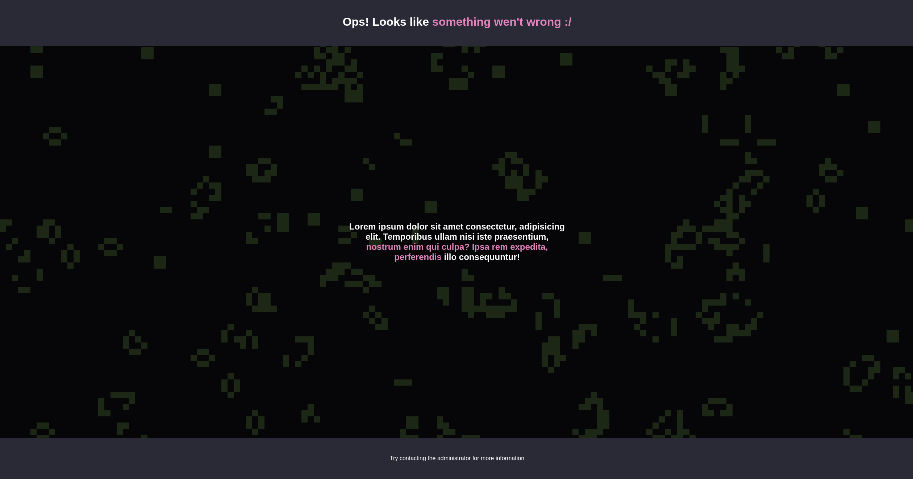

## Concept

The idea of this project is to validate the idea of using [P5.js](https://p5js.org) with React to create creative and possibly interactive pages, so I decided to build a page that uses a P5 canvas running [Conway's Game of Life](https://en.wikipedia.org/wiki/Conway's_Game_of_Life) as background.

All the implementation of the game of life itself is contained within `src/lib/p5-game-of-life` and this lib exposes a component witch can be rendered by a react page.

I decided to make a generic and very simple error page as an example

